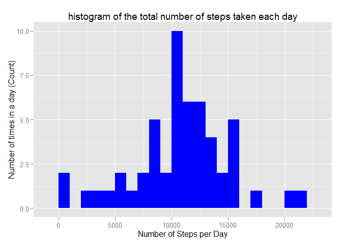
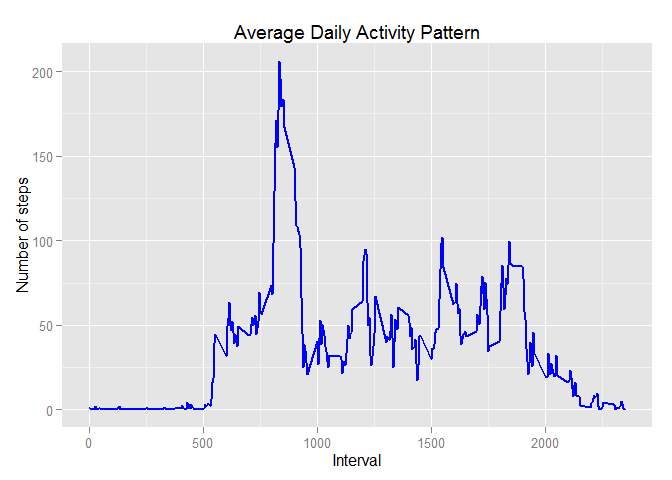
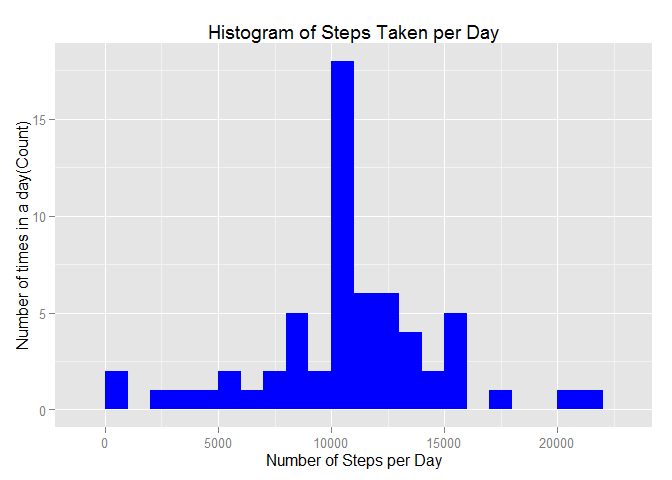
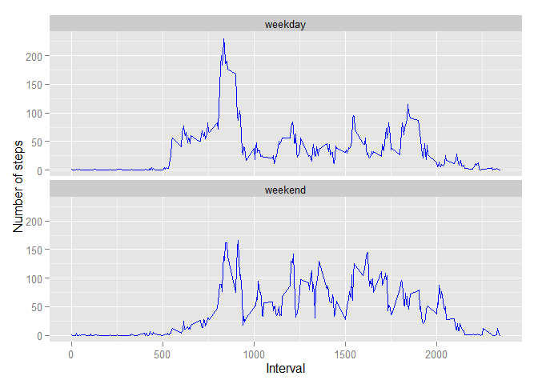

# Reproducible Research: Peer Assessment 1
Huy Dao  
Sunday, April 19, 2015  


## Introduction

This assignment use R markdown to write a report that answers the questions detailed in the sections below. In the process, the single R markdown document will be processed by knitr and be transformed into an HTML file.


## Loading appropriate library and setting options


```r
library(knitr)
opts_chunk$set(echo = TRUE)
library(ggplot2)
```


## Loading and preprocessing the data


```r
setwd("g:/DSCoursera/RepData_PeerAssessment1/activity")
data <- read.csv('activity.csv', header = TRUE, sep = ",")
str(data)
```

```
## 'data.frame':	17568 obs. of  3 variables:
##  $ steps   : int  NA NA NA NA NA NA NA NA NA NA ...
##  $ date    : Factor w/ 61 levels "2012-10-01","2012-10-02",..: 1 1 1 1 1 1 1 1 1 1 ...
##  $ interval: int  0 5 10 15 20 25 30 35 40 45 ...
```

```r
data$date  <- as.Date(data$date)
data$interval <- as.factor(data$interval)
str(data)
```

```
## 'data.frame':	17568 obs. of  3 variables:
##  $ steps   : int  NA NA NA NA NA NA NA NA NA NA ...
##  $ date    : Date, format: "2012-10-01" "2012-10-01" ...
##  $ interval: Factor w/ 288 levels "0","5","10","15",..: 1 2 3 4 5 6 7 8 9 10 ...
```

## What is mean total number of steps taken per day?


```r
steps_per_day <- aggregate(steps ~ date, data, sum)
colnames(steps_per_day) <- c("Date","Steps")
head(steps_per_day)
```

```
##         Date Steps
## 1 2012-10-02   126
## 2 2012-10-03 11352
## 3 2012-10-04 12116
## 4 2012-10-05 13294
## 5 2012-10-06 15420
## 6 2012-10-07 11015
```

### Make a histogram of the total number of steps taken each day

```r
ggplot(steps_per_day, aes(x = Steps)) + 
  geom_histogram(fill = "blue", binwidth = 1000) + 
  labs(title="histogram of the total number of steps taken each day", 
       x = "Number of Steps per Day", y = "Number of times in a day (Count)")
```

 

### Calculate and report the mean and median total number of steps taken per day

```r
mean   <- mean(steps_per_day$Steps, na.rm=TRUE)
mean
```

```
## [1] 10766.19
```

```r
median <- median(steps_per_day$Steps, na.rm=TRUE)
median
```

```
## [1] 10765
```

## What is the average daily activity pattern?

```r
steps_per_interval <- aggregate(data$steps, 
                                by = list(interval = data$interval),
                                FUN=mean, na.rm=TRUE)
#convert to integers
steps_per_interval$interval <- 
  as.integer(levels(steps_per_interval$interval)[steps_per_interval$interval])
colnames(steps_per_interval) <- c("Interval", "Steps")
```

### Make a time series plot (i.e. type = "l") of the 5-minute interval (x-axis) and the average number of steps taken, averaged across all days (y-axis)


```r
ggplot(steps_per_interval, aes(x=Interval, y=Steps)) +   
  geom_line(color="blue", size=1) +  
  labs(title="Average Daily Activity Pattern", x="Interval", y="Number of steps")
```

 


### Which 5-minute interval, on average across all the days in the dataset, contains the maximum number of steps?

```r
max_interval <- steps_per_interval[which.max(  
  steps_per_interval$Steps),]
max_interval
```

```
##     Interval    Steps
## 104      835 206.1698
```

The maximum average number of steps is: 206.17 and occurs in time interval #835

## Imputing missing values

### Calculate and report the total number of missing values in the dataset (i.e. the total number of rows with NAs)

```r
num_steps_missing <- sum(is.na(data$steps))
num_steps_missing
```

```
## [1] 2304
```

```r
num_date_missing <- sum(is.na(data$date))
num_date_missing
```

```
## [1] 0
```

```r
num_interval_missing <- sum(is.na(data$interval))
num_interval_missing
```

```
## [1] 0
```

Only the steps column contains missing value. There are a total of 2304 rows with missing data

### Devise a strategy for filling in all of the missing values in the dataset. The strategy does not need to be sophisticated. For example, you could use the mean/median for that day, or the mean for that 5-minute interval, etc.
We will use the average of all the steps

### Create a new dataset that is equal to the original dataset but with the missing data filled in.


```r
newData <- data

for (i in 1:nrow(newData)) {
  if (is.na(newData$steps[i])) {
    index <- newData$interval[i]
    value <- subset(steps_per_interval, Interval==index)
    newData$steps[i] <- value$Steps
  }
}
head(newData)
```

```
##       steps       date interval
## 1 1.7169811 2012-10-01        0
## 2 0.3396226 2012-10-01        5
## 3 0.1320755 2012-10-01       10
## 4 0.1509434 2012-10-01       15
## 5 0.0754717 2012-10-01       20
## 6 2.0943396 2012-10-01       25
```

### Make a histogram of the total number of steps taken each day and Calculate and report the mean and median total number of steps taken per day. Do these values differ from the estimates from the first part of the assignment? What is the impact of imputing missing data on the estimates of the total daily number of steps?


```r
fill_steps_per_day <- aggregate(steps ~ date, newData, sum)
colnames(fill_steps_per_day) <- c("Date","Steps")

##plotting the histogram
ggplot(fill_steps_per_day, aes(x = Steps)) + 
  geom_histogram(fill = "blue", binwidth = 1000) + 
  labs(title="Histogram of Steps Taken per Day", 
       x = "Number of Steps per Day", y = "Number of times in a day(Count)")
```

 

```r
steps_mean_fill   <- mean(fill_steps_per_day$Steps, na.rm=TRUE)
steps_mean_fill
```

```
## [1] 10766.19
```

```r
steps_median_fill <- median(fill_steps_per_day$Steps, na.rm=TRUE)
steps_median_fill
```

```
## [1] 10766.19
```

These mean and median values do not differ much from the estimates from the first part of the assignment.
After imputing missing data, the distribution of the histogram remains the same, but the count of frequency increases.

## Are there differences in activity patterns between weekdays and weekends?

### Create a new factor variable in the dataset with two levels -- "weekday" and "weekend" indicating whether a given date is a weekday or weekend day.

```r
weekdays_steps <- function(data) {
  weekdays_steps <- aggregate(data$steps, by=list(interval = data$interval),
                              FUN=mean, na.rm=T)
  # convert to integers for plotting
  weekdays_steps$interval <- 
    as.integer(levels(weekdays_steps$interval)[weekdays_steps$interval])
  colnames(weekdays_steps) <- c("interval", "steps")
  weekdays_steps
}

data_by_weekdays <- function(data) {
  data$weekday <- 
    as.factor(weekdays(data$date)) # weekdays
  weekend_data <- subset(data, weekday %in% c("Saturday","Sunday"))
  weekday_data <- subset(data, !weekday %in% c("Saturday","Sunday"))
  
  weekend_steps <- weekdays_steps(weekend_data)
  weekday_steps <- weekdays_steps(weekday_data)
  
  weekend_steps$dayofweek <- rep("weekend", nrow(weekend_steps))
  weekday_steps$dayofweek <- rep("weekday", nrow(weekday_steps))
  
  data_by_weekdays <- rbind(weekend_steps, weekday_steps)
  data_by_weekdays$dayofweek <- as.factor(data_by_weekdays$dayofweek)
  data_by_weekdays
}
```
### Make a panel plot containing a time series plot (i.e. type = "l") of the 5-minute interval (x-axis) and the average number of steps taken, averaged across all weekday days or weekend days (y-axis). 


```r
data_weekdays <- data_by_weekdays(newData)

ggplot(data_weekdays, aes(x=interval, y=steps)) + 
  geom_line(color="blue") + 
  facet_wrap(~ dayofweek, nrow=2, ncol=1) +
  labs(x="Interval", y="Number of steps")
```

 

We observe that activity on the weekdays and weekends differ. Activities on weekdays mostly follow a work related routine, with peaks in the morning between 7 and 9. At weekend we can see better distribution of effort along the time, but the level of activities remain higher than that of the weekdays.
## End of the peer assessment 1
